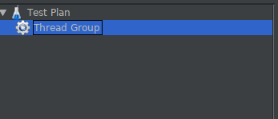
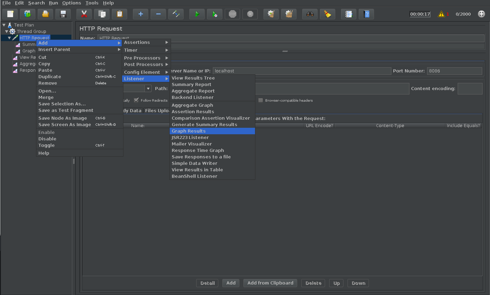

## PRUEBAS DE CARGA Y ESTRES CON JMETER

---

**Reuisitos :** 
- instalar [JMeter](https://jmeter.apache.org/)

Para manjaro:

```javascript
sudo pacman -S jmeter
//or 
yay  -S jmeter
```
---

Para añadir a nuestro proyecto de JMeter un grupo de Hilos que se encargará de lanzar las peticiones deberemos ir al siguiente menú.





En este caso simplemente se ha modificado el Thread Group para que tenga 2000 hilos (Number of Threads) .y 5 segundos es decir que mandara 2000 por segundo para un total de 10000 peticiones.

El siguiente paso es configurar el grupo de hilos para que realicen algún tipo de petición .En este caso vamos a elegir una petición web (Http Request)


Estamos ya a punto de finalizar la configuración de las pruebas de carga. Ahora bien necesitamos alguna forma de saber si las peticiones que lanzamos se ejecutan de forma correcta . Para ello usaremos el concepto de Listener el cual se encarga de almacenar los resultados. En este caso usaremos el listener de resumen que es el mas sencillo.


Luego al darle play 


se  obtiene que se realizaron 10000 solicitudes y tuvieron un porcentaje de error de 8.86%

### Graficas de resultados - JMeter

Para realizar las revisar los resultados de forma gráfica con JMeter se utiliza el mismo procedimiento anterior, solo que al final, no se utiliza el listener "Summary Report" en cambio se utiliza el listener "Graph Results" como se muestra a continuación:



Luego al darle play se observan los resultados: 


En la gráfica los puntos negros representan el tiempo de respuesta de cada petición y en verde el Throughput del sistema. Además, en ella se puede configurar si se requiere algunos datos de más como lo son el tiempo medio de respuesta, la mediana y la desviación. Datos que son iguales a los que se representan con el listener "Summary Report".


