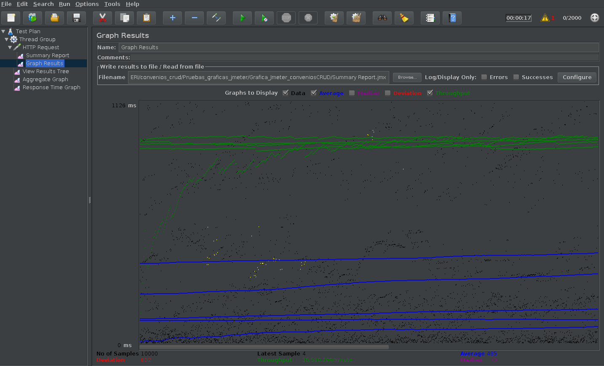

# **Pruebas de carga convenios_CRUD**
Para realizar las pruebas de carga de las APIs desarrolladas se utiliza JMeter, es una herramienta de carga para llevar acabo simulaciones sobre cualquier recurso de Software. 

## Prueba GET para el EndPoint 

|                |link de prueba                  |End Point|
|----------------|-------------------------------|------------------------|
| **Obtiene datos asociados a los convenios** |[GetAll](http://127.0.0.1:8082/v1/convenio)| `127.0.0.1:8080/v1/convenio` |

Los parametros de configuración para la pruebas de cargas son :

|Numero de peticiones  |Periodo Ramp-up en  segundos   |Duración total de peticiones en segundos|
|----------------------|-------------------------------|----------------------------------------|
|2000       |1 segundo    |5 segundos|

Resultados de la prueba:

|Label       | # Samples    | Average | Min |  Max | Dev. std. | Error % | Throughput | Received KB/sec | Sent KB/sec| Avg.Bytes|
|------------|--------------|---------|-----|------|-----------|---------|------------|-----------------|------------|----------|
|HTTP Request|10000         |485    |1   |7891 | 832.26 | 0.62%   |593.2 /sec   |  260.43          |  75.30      | 449.6   |
|Total|10000         |485    |1   |7891 | 832.26 | 0.62%   |593.2 /sec   |  260.43          |  75.30      | 449.6   |

## Gráfica resultado de prueba GET para el Endpoint

En negro el tiempo de respuesta a cada una de las peticiones, en verde el Throughput del sistema y en azul el tiempo medio de respuesta.