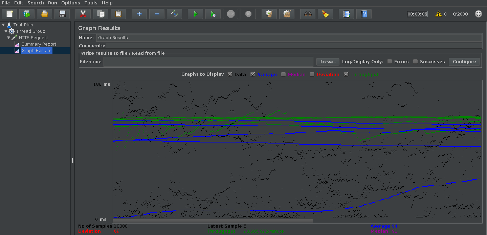
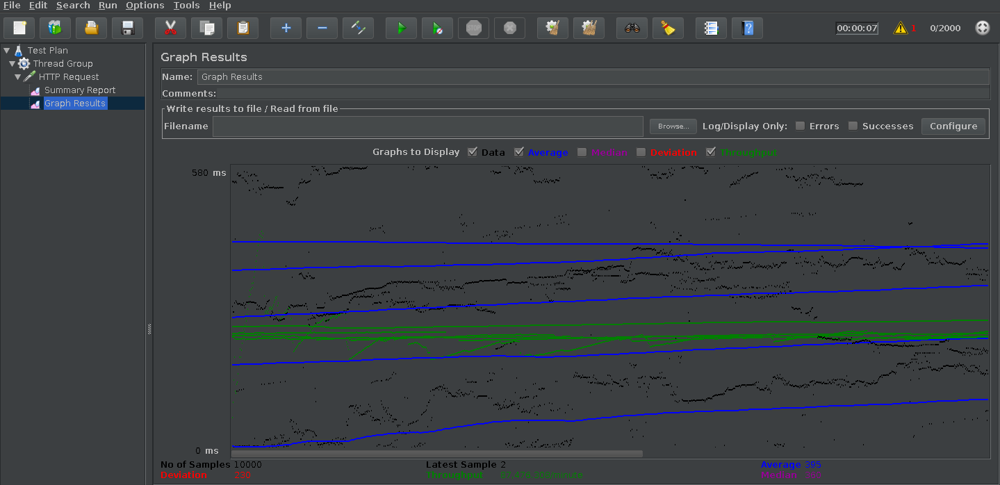

# **Pruebas de carga movilidad_academica_MID**
Para realizar las pruebas de carga de las APIs desarrolladas se utiliza JMeter, es una herramienta de carga para llevar acabo simulaciones sobre cualquier recurso de Software. 

## *Prueba GET para el EndPoint convenio/GetConvenio*

Los parametros de configuración para la pruebas de cargas son :

|Numero de peticiones  |Periodo Ramp-up en  segundos   |Duración total de peticiones en segundos|
|----------------------|-------------------------------|----------------------------------------|
|2000       |1 segundo    |5 segundos|  

Resultados prueba de carga

|Label       | # Samples    | Average | Min |  Max | Dev. std. | Error % | Throughput | Received KB/sec | Sent KB/sec| Avg.Bytes|
|------------|--------------|---------|-----|------|-----------|---------|------------|-----------------|------------|----------|
|HTTP Request|10000         |7    |7   |263 | 26.91| 0%   |2040.0/sec   |  2165.49         |  280.90      | 1087.0   |
|Total| 10000         |7    |7   |263 | 26.91| 0%   |2040.0/sec   |  2165.49         |  280.90      | 1087.0   |

La gráfica de respuesta para la prueba de carga de convenio/GetConvenio es : 

## *Prueba GET para el EndPoint academica/GetAcademica*

Resultados prueba de carga

|Label       | # Samples    | Average | Min |  Max | Dev. std. | Error % | Throughput | Received KB/sec | Sent KB/sec| Avg.Bytes|
|------------|--------------|---------|-----|------|-----------|---------|------------|-----------------|------------|----------|
|HTTP Request|10000         |395    |0   |1263 | 230.84| 0%   |1457.9/sec   |  3861.26         |  203.60      | 2712.0   |
|Total|10000         |395    |0   |1263 | 230.84| 0%   |1457.9/sec   |  3861.26         |  203.60      | 2712.0   |

La gráfica de respuesta para la prueba de carga de academica/GetAcademica es : 

