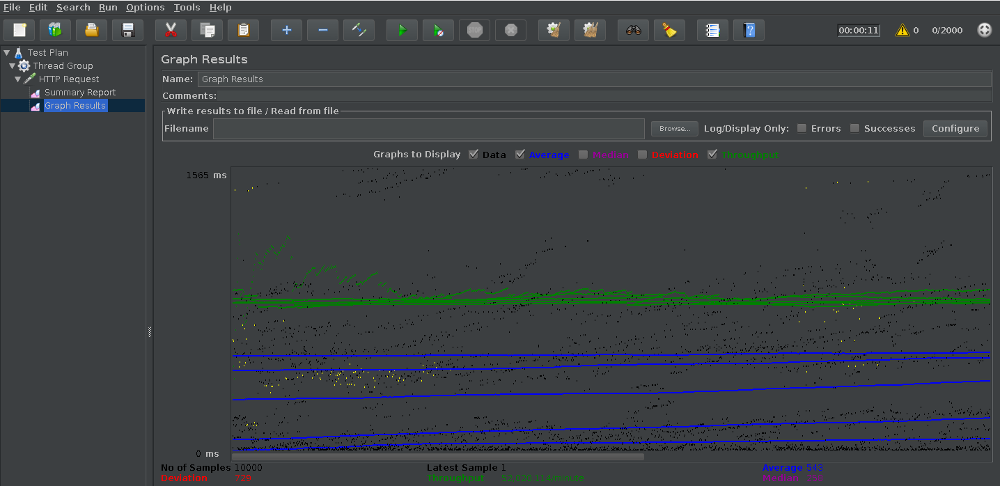
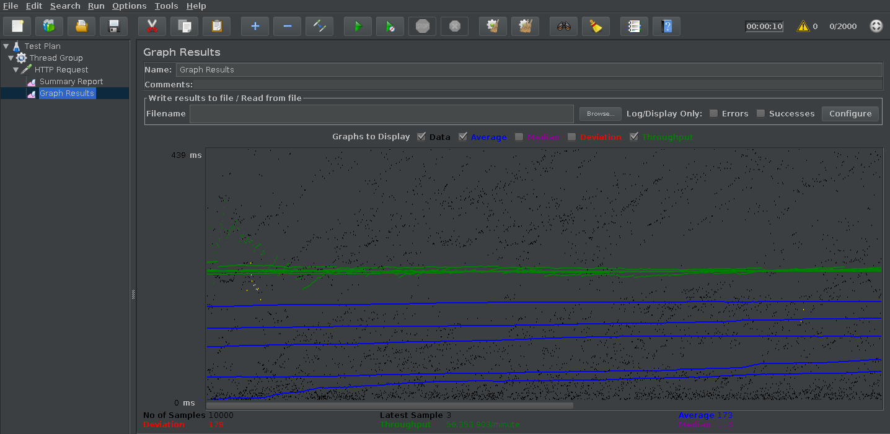
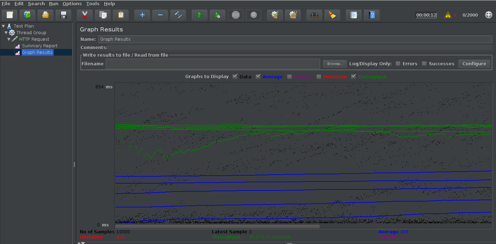

### Pruebas de carga movilidad_academica_crud

Para realizar las pruebas de carga de las APIs desarolladas se utiliza JMeter, es una herramienta de carga para llevar acabo simulaciones sobre cualquier recurso de Software. 

Inicialmente diseñada para pruebas de estrés en aplicaciones web, hoy en día, su arquitectura ha evolucionado no sólo para llevar acabo pruebas en componentes habilitados en Internet (HTTP), sino además en Bases de Datos , programas en Perl , requisiciones FTP y prácticamente cualquier otro medio. 

### Prueba GET para el EndPoint tipo_movilidad

Los parametros de configuración para la pruebas de cargas son :

|Numero de peticiones  |Periodo Ramp-up en  segundos   |Duración total de peticiones en segundos|
|----------------------|-------------------------------|----------------------------------------|
|2000       |1 segundo    |5 segundos|  

Resultados prueba de carga

|Label       | # Samples    | Average | Min |  Max | Dev. std. | Error % | Throughput | Received KB/sec | Sent KB/sec| Avg.Bytes|
|------------|--------------|---------|-----|------|-----------|---------|------------|-----------------|------------|----------|
|HTTP Request|10000         |15778    |14   |202743 | 28871.12 | 3.01%   |48.8 /sec   |  58.76          |  6.38      | 1232.6   |
|Total|10000         |15778    |14   |202743 | 28871.12 | 3.01%   |48.8 /sec   |  58.76          |  6.38      | 1232.6   |

Gráfica resultado prueba de carga para endpoint tipo_movilidad

### Prueba GET para el EndPoinst tipo_categoria

Los parametros de configuración para la pruebas de cargas son :

|Numero de peticiones  |Periodo Ramp-up en  segundos   |Duración total de peticiones en segundos|
|----------------------|-------------------------------|----------------------------------------|
|2000       |1 segundo    |5 segundos|  

Resultados prueba de carga

|Label       | # Samples    | Average | Min |  Max | Dev. std. | Error % | Throughput | Received KB/sec | Sent KB/sec| Avg.Bytes|
|------------|--------------|---------|-----|------|-----------|---------|------------|-----------------|------------|----------|
|HTTP Request|10000         |15789   |15   |176269 | 29895.52| 2.19%   |54.6 /sec   |  37.04          |  7.19      | 695.0   |
|Total|10000         |15789   |15   |176269 | 29895.52| 2.19%   |54.6 /sec   |  37.04          |  7.19      | 695.0   |

Gráfica resultado prueba de carga para endpoint tipo_categoria

### Prueba GET para el EndPoint movilidad

Los parametros de configuración para la pruebas de cargas son :

|Numero de peticiones  |Periodo Ramp-up en  segundos   |Duración total de peticiones en segundos|
|----------------------|-------------------------------|----------------------------------------|
|2000       |1 segundo    |5 segundos|  

Resultados prueba de carga

|Label       | # Samples    | Average | Min |  Max | Dev. std. | Error % | Throughput | Received KB/sec | Sent KB/sec| Avg.Bytes|
|------------|--------------|---------|-----|------|-----------|---------|------------|-----------------|------------|----------|
|HTTP Request|10000         |15251   |14   |165699 | 27490.34| 2.02%   |49.6 /sec   |  23.69          |  6.31      | 489.2   |
|Total|10000         |15251   |14   |165699 | 27490.34| 2.02%   |49.6 /sec   |  23.69          |  6.31      | 489.2   |

Gráfica de resultado de la prueba de carga : 

