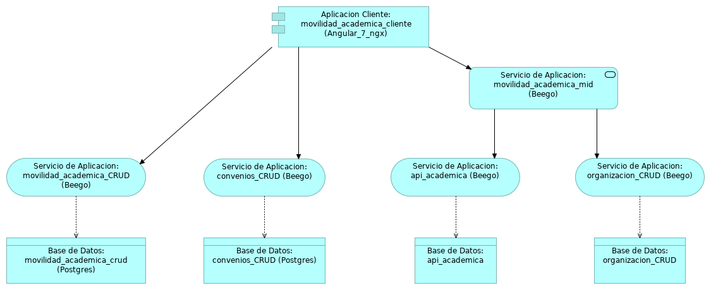

# Documentación General de la aplicación Movilidad Academica para la dependecia CERI

Esta documentación concentra toda la documentación requerida para enteder el proyecto de movilidad academica desarrollada para la dependecia CERI de la Universidad Distrital Francisco Jose De Caldas, el proyecto nace de la necesidad de actualizar la aplicacion [actual](https://ceri.udistrital.edu.co/plataforma-de-apoyo) de la depencia. 

## Comenzando 🚀
La arquitectura de la aplicacion desarrollada se expone en la siguiente imagen.

### Pre-requisitos 📋

Para el correcto despliegue del proyecto es necesario contar con las siguientes herramientas:

* [golang](https://golang.org/) - Lenguaje de programación 
* [Beego](https://beego.me/) - Framework  usado
* [PgModeles](https://pgmodeler.io/) - PostgreSQL Database Modeler
* [PgAdmin3](https://www.pgadmin.org/) - Motor para bases de datos
* [Angular](https://angular.io/) - Framework FrontEnd

